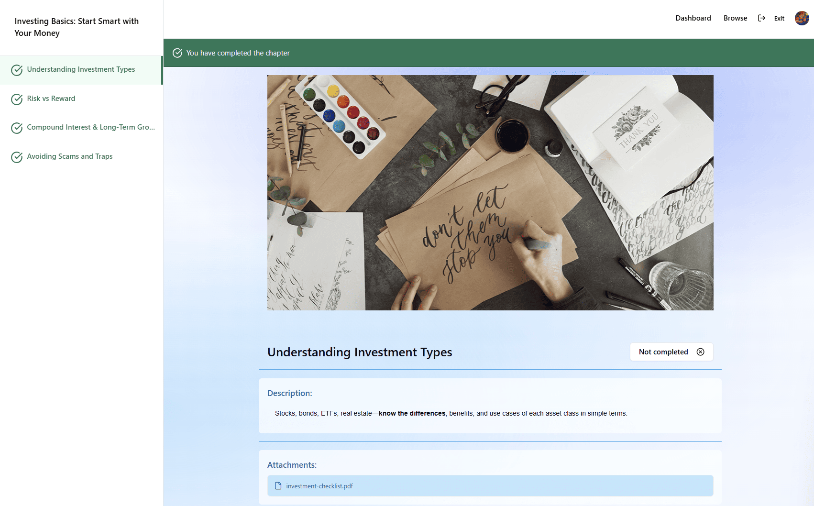

# Nexus — Student Course Page

The **Student Course Page** is the primary learning interface users are redirected to when they select a course. Instead of showing a course overview, the user lands directly on a specific chapter (typically the first or the next unfinished chapter) to start learning immediately.

---

## Screenshot

---

## Page Structure

### 1. Top Navigation Bar
- **Dashboard**
- **Browse**
- **Teacher mode toggle**
- **User profile avatar** with account settings access
---

### 2. Sidebar (Course Navigation)
- **Course title** at the top.
- **Ordered chapter list** showing all chapters in the course.
  - Each item shows chapter title and a small status badge (In progress, Completed, Locked).
  - Current chapter is highlighted.
- **Quick navigation**: click any chapter to jump to it.
- Scrollable if course has many chapters.

---

### 3. Main Content Area
**Primary lesson view with the following blocks:**

- **Video Player**
  - Central large player (or embedded content) for lesson video.
  - Playback controls, speed, captions/transcript toggle.
- **Chapter Header**
  - Chapter title and short subtitle.
- **Chapter Description**
  - Short text describing the lesson objectives and what will be covered.
- **Attachments / Resources**
  - List of attached files and resources (PDFs, slides, code samples) with download links or open actions.
  - Each attachment shows filename, type, and size.
- **Lesson Controls**
  - **Mark as completed** button (toggles between completed / not completed).
- **Real-time Feedback**
  - Toast/inline confirmation when a chapter is marked completed.
  - Visual update to progress bar and chapter status immediately after action.

---

## User Experience Flow

### Chapter Redirect & Learning Flow
1. User selects a course → the app **redirects** directly to the current/first chapter of that course.  
2. The user watches the video and reviews attachments in the main content area.  
3. When ready, the user clicks **Mark as completed**:
   - The chapter status is updated **in real-time** (optimistic UI or via server push).
   - A confirmation appears (confetti) indicating the chapter is completed.
   - The user is **automatically redirected** to the **next chapter** in sequence.
   - The completed chapter is visually marked in the sidebar and progress indicators update across the UI (e.g., dashboard, course list).
4. If the user completes the final chapter, the course is marked as **Completed** and the user may be redirected to the course overview or Dashboard.

---

## Access Rules

- **Authenticated users** → Progress tracking and completion features require login.
- **Enrolled or free courses only** → Only courses the user has purchased or that are free will redirect to chapters and allow marking as completed.
- **Progress persistence** → Chapter completion and progress are saved server-side and reflected across all user devices.
- **Attachments access** → Attached resources are available to users enrolled in the course (subject to course access rules).

---

## Additional Notes

- Real-time updates (e.g., via WebSocket / server-sent events or API responses with optimistic updates) ensure progress and UI state stay consistent across components (sidebar, dashboard, course lists).
- If a network error occurs when marking a chapter completed, the UI should retry the update or queue it for sync and notify the user.
- Completed chapters remain accessible for review; users can re-open previously completed lessons at any time.
