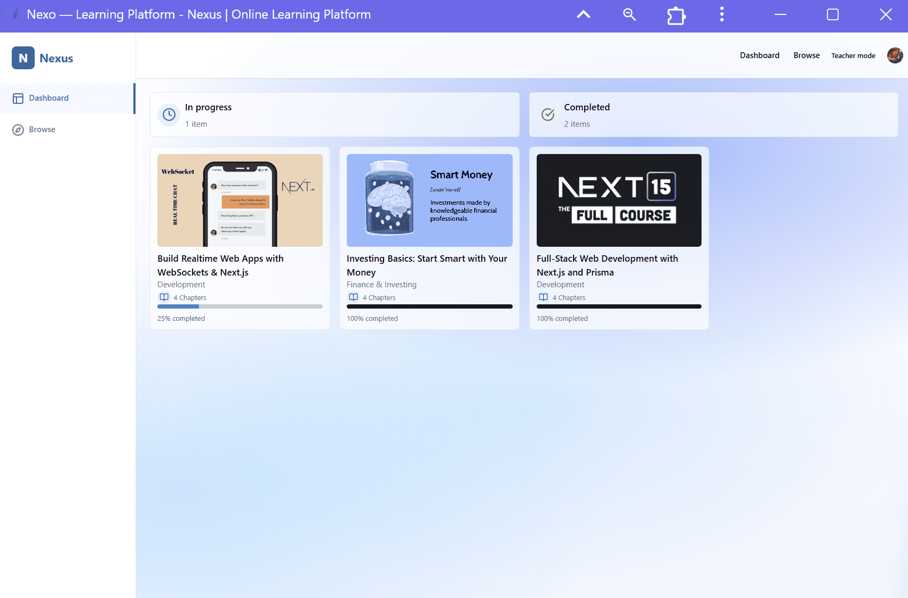

# Nexus — Dashboard (Home Page)

The **Dashboard** (also serving as the Home Page) is the central hub where users can view their enrolled and active courses, track progress, and quickly access learning materials.

---

## Screenshot

---

## Page Structure

### 1. Navigation Sidebar
- **Nexus logo** and branding
- **Main navigation sections**:
  - Dashboard (current active page)
  - Browse

---

### 2. Top Navigation Bar
- **Dashboard**
- **Browse**
- **Teacher mode toggle**
- **User profile avatar** with account settings access

---

### 3. Progress Overview Cards
- **In Progress Card**
  - Displays the number of active courses currently being taken
  - Example: "1 item"
- **Completed Card**
  - Displays the number of courses fully completed
  - Example: "2 items"

---

### 4. Course Cards Section
**Displayed in a horizontal layout under their respective status cards:**

Each **Course Card** shows:
- **Course thumbnail** with visual branding
- **Course title** (e.g., *Build Realtime Web Apps with WebSockets & Next.js*)
- **Category label** (Development, Finance & Investing, etc.)
- **Chapter count** with book icon (e.g., "4 Chapters")
- **Progress indicators**:
  - Percentage completed (e.g., 25% completed, 100% completed)
  - Visual progress bar

---

## User Experience Flow

### Course Enrollment Process
1. User purchases or enrolls in a free course  
2. The course automatically appears on the **Dashboard**  
3. Course status updates dynamically between **In Progress** and **Completed**

### Learning Progress
- **In Progress Section** → Tracks partially completed courses  
- **Completed Section** → Displays fully completed courses with 100% progress  
- **Direct Access** → Users can click a course card to continue learning immediately

---

## Access Rules
- **Purchased or free courses** → Both appear in the Dashboard  
- **Progress persistence** → Learning progress is saved and synced across sessions

---

## Additional Notes
- Dashboard reflects real-time data from user’s learning profile  
- Courses automatically move from **In Progress** to **Completed** once finished  
- Users can re-access completed courses anytime for lifetime access  
- Serves as the entry point for all personalized learning activity
