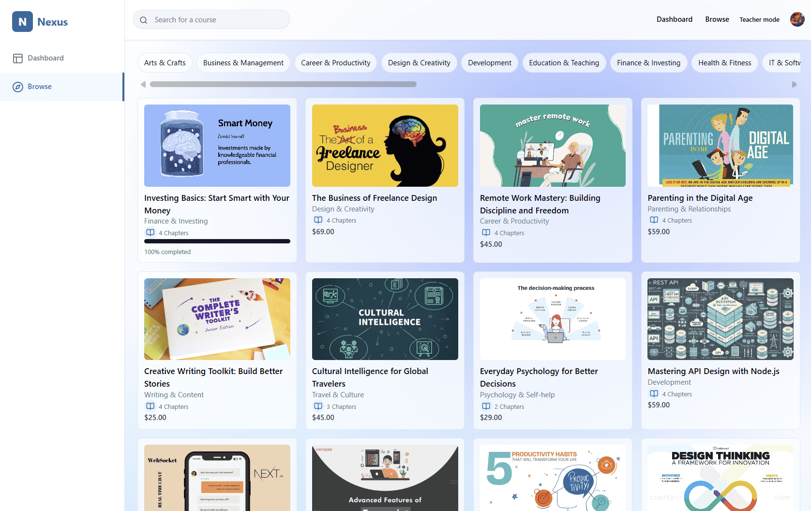

# Nexus — Course Search

The **Course Search** is a comprehensive browsing page where users can discover and explore all available courses across different categories and subjects.

---

## Screenshot

---

## Page Structure

### 1. Navigation Header
- **Nexus logo** and branding
- **Search bar** with placeholder "search for a course"
- **Top navigation menu**:
  - Dashboard
  - Browse (current active page)
  - Teacher mode toggle
- **User profile avatar** with access to account settings

---

### 2. Category Filter Bar
Horizontal scrollable categories:
- Arts & Crafts
- Business & Management
- Career & Productivity
- Design & Creativity
- Development (highlighted/selected)
- Education & Teaching
- Finance & Investing
- Health & Fitness
- IT & Software

---

### 3. Course Grid Display
**Course Cards** arranged in a responsive grid layout showing:

**Course Information:**
- **Visual thumbnail** with course-specific illustrations and branding
- **Course title** (e.g., "Investing Basics: Start Smart with Your Money")
- **Category classification** (Finance & Investing, Design & Creativity, etc.)
- **Chapter count** with book icon (e.g., "4 Chapters")
- **Pricing** displayed prominently (e.g., $69.00, $45.00, $59.00)

**Progress Indicators** (for enrolled courses):
- Completion bar showing learning progress
- "100% completed" status for finished courses

---

## Search & Discovery Features

### Search Functionality
- **Global search bar** allows searching by course title or description
- **Real-time filtering** as users type their queries
- **Category-based browsing** for organized course discovery

### Category Navigation
- **Horizontal scrollable filter** for easy category switching
- **Active category highlighting** shows current selection
- **Comprehensive categorization** covering diverse learning topics

---

## User Experience Flow

### Course Discovery Process
1. User navigates to **Browse** page from main navigation  
2. **Category selection** → Filter courses by subject area  
3. **Search functionality** → Find specific courses by keywords  
4. **Course preview** → View course details, pricing, and chapter information  
5. **Course enrollment** → Click to view full course details and purchase

### Browsing Experience
- **Visual course cards** → Easy scanning of available options  
- **Clear pricing display** → Transparent cost information  
- **Progress tracking** → Shows completion status for enrolled courses  
- **Responsive grid layout** → Optimal viewing across devices

---

## Access Rules
- **Enhanced features** → Users see enrollment status and progress  
- **Purchase integration** → Direct links to course detail pages for enrollment  

---

## Additional Notes
- Course Search updates dynamically as new courses are added  
- Pricing is displayed in real-time with current promotional offers  
- Category filters persist during browsing session  
- Search functionality includes course titles, descriptions, and instructor names  
- Grid layout adapts responsively for mobile and desktop viewing  
