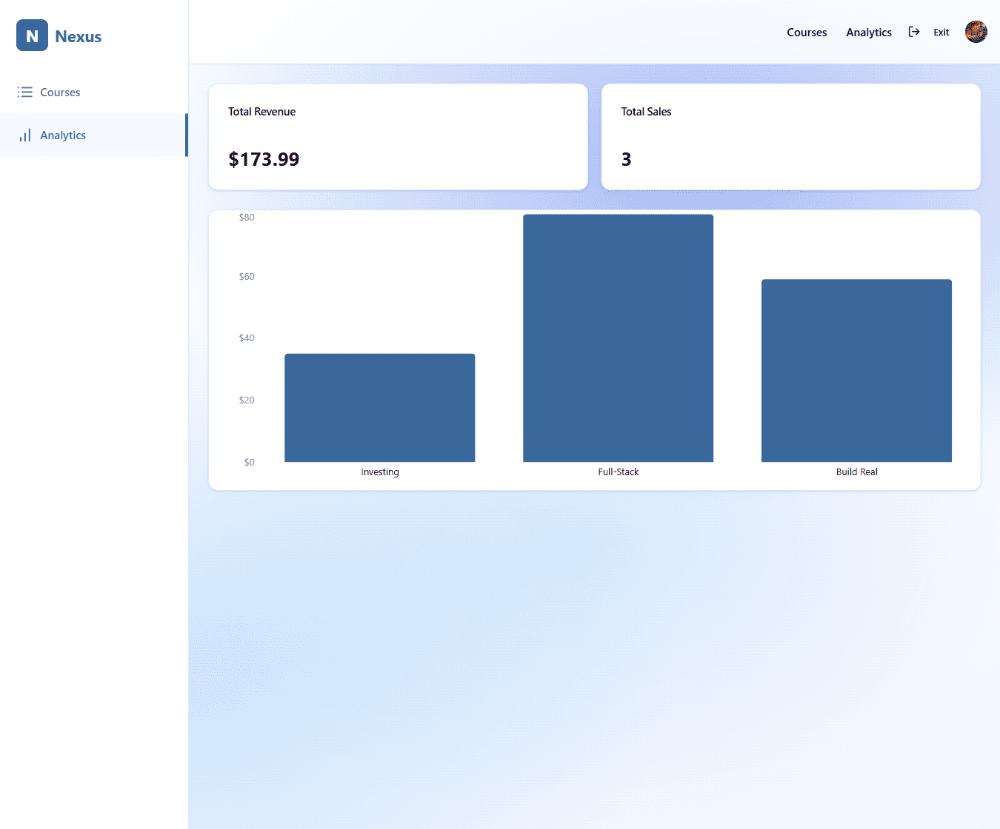

# Nexus — Teacher Analytics

The **Teacher Analytics** page provides instructors with a high-level overview of their course performance, sales, and revenue. It includes summary metrics and a revenue chart per course.

---

## Screenshot

---

## Page Structure

### 1. Navigation Header
- **Nexus logo** and branding  
- **Top navigation menu**:  
  - Courses  
  - Analytics (current active page)  
- **User profile avatar** with access to account settings  

---

### 2. Analytics Overview Cards
Three key metric cards are displayed at the top of the page:

1. **Total Revenue** → Displays cumulative revenue from all courses  
2. **Total Sales** → Shows the total number of course purchases across all courses  
3. **Other Key Metric** → Space for additional stat if needed in the future  

---

### 3. Revenue Chart
- **Chart Type**: Vertical bar chart  
- **X-Axis (OX)**: Course titles  
- **Y-Axis (OY)**: Total revenue for each course  
- Each bar represents the revenue generated by a specific course  

---

## User Experience Flow

1. Teacher navigates to **Analytics** page  
2. Teacher reviews **summary cards** (revenue & sales)  
3. Teacher analyzes the **bar chart** to see how each course is performing financially  
4. Teacher can return to **Courses** to manage underperforming or high-potential courses  

---

## Access Rules
- Only teachers (authenticated with teacher role) can access this page  
- Data is aggregated across all courses owned by the teacher  

---

## Additional Notes
- Chart updates dynamically as new sales are made  
- Revenue and sales data are updated in real time or on refresh  
