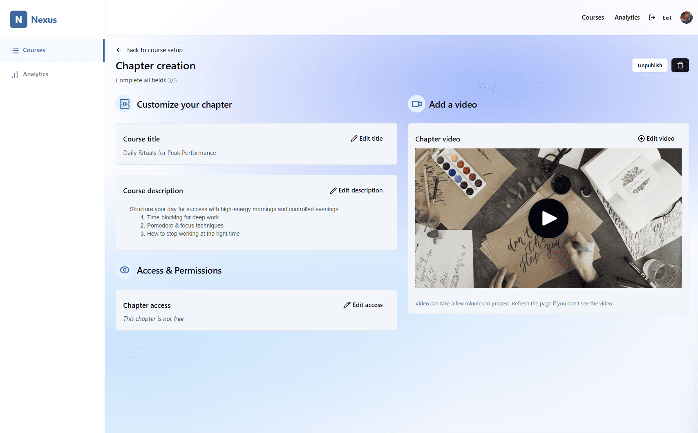

# Nexus — Teacher Edit Chapter

The **Edit Chapter** page allows instructors to manage and customize individual chapters within a course. It provides publishing controls, content editing, pricing permissions, and media attachment options.

---

## Screenshot

---

## Page Structure

### 1. Navigation Header
- **Nexus logo** and branding  
- **Top navigation menu**:  
  - Courses  
  - Analytics  
- **User profile avatar** with access to account settings  

---

### 2. Page Actions (Top Controls)
- **Publish / Unpublish button** (toggle depending on current status)  
- **Delete button** (Trash Icon) → Removes the course and all associated chapters (cascade delete)  

---

### 3. Chapter Content Editor
Form-based editor with the following fields:  

- **Chapter Title** → Editable text field  
- **Chapter Description** → Rich text area for detailed explanation  
- **Permissions** → Toggle/selector to define whether the chapter is:  
  - **Free**  
  - **Paid**  
- **Video Upload/Attachment** → Add or change the instructional video for this chapter  

---

## User Experience Flow

1. Teacher navigates to a course and selects a specific chapter to edit  
2. Teacher adjusts **title, description, and permissions** (free/paid)  
3. Teacher uploads or updates the **video content** for the chapter  
4. Teacher chooses to:  
   - **Publish / Unpublish** chapter  
   - **Delete chapter** (permanent removal)  

---

## Access Rules
- Only course owners (teachers) can edit, publish, or delete chapters  
- Deletion is permanent and requires confirmation  

---

## Additional Notes
- Publish/Unpublish dynamically updates chapter status in real time  
- Permissions determine whether a chapter is accessible without payment  
- Video integration supports multiple formats for flexibility  
- Changes are immediately reflected in the student learning interface  
