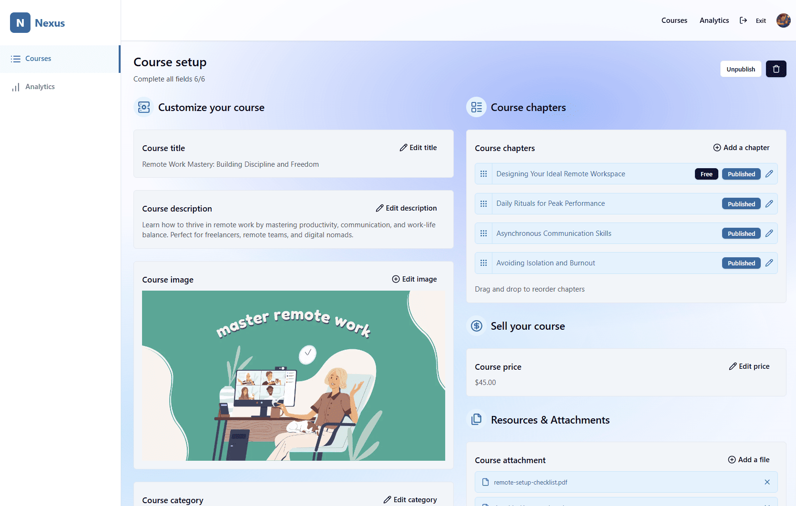

# Nexus — Teacher Course Edit

The **Teacher Course Edit** page allows instructors to manage and customize individual courses. It provides publishing controls, editing tools, and content management options.

---

## Screenshot

---

## Page Structure

### 1. Navigation Header
- **Nexus logo** and branding  
- **Top navigation menu**:  
  - Courses  
  - Analytics  
- **User profile avatar** with access to account settings  

---

### 2. Page Actions (Top Controls)
- **Publish / Unpublish button** (toggle depending on current status)  
- **Delete button** (Trash Icon) → Removes the course and all associated chapters (cascade delete)  

---

### 3. Course Content Editor
Form-based editor with the following fields:  

- **Course Title** → Editable text field  
- **Course Description** → Rich text area for detailed description  
- **Course Image** → Upload/change thumbnail image representing the course  
- **Course Category** → Dropdown selection for categorizing the course  
- **Chapters Section**:  
  - Create new chapters  
  - Edit existing chapters  
  - Manage publishing status for chapters  
- **Course Price** → Input field for setting the course price  
- **Attachments** → Upload and manage files associated with the course  

---

## User Experience Flow

1. Teacher navigates to **Courses → Edit** page  
2. Teacher adjusts **title, description, category, and image**  
3. Teacher creates or edits **chapters** for structured learning content  
4. Teacher sets **pricing** and attaches **supporting files**  
5. Teacher decides to:  
   - **Publish / Unpublish** course  
   - **Delete course** (permanent, cascades through chapters)  

---

## Access Rules
- Only course owners (teachers) can edit or delete courses  
- Delete action requires confirmation to prevent accidental data loss  

---

## Additional Notes
- Publish/Unpublish button dynamically changes depending on course status  
- Cascade deletion ensures no orphaned chapters remain after course removal  
- Real-time updates ensure edits reflect immediately across the platform  
- Attachments and chapters can be managed independently within the editor  
