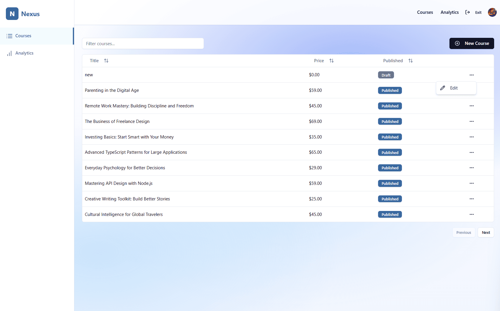

# Nexus — Teacher Courses

The **Teacher Courses** page is the central hub for instructors to manage their created courses. It provides a table view with sorting, filtering, and course management options.

---

## Screenshot

---

## Page Structure

### 1. Navigation Header
- **Nexus logo** and branding
- **Top navigation menu**:
  - Courses (current active page)
  - Analytics
  - Student mode toggle
- **User profile avatar** with access to account settings

---

### 2. Page Actions (Above the Table)
- **Search input** for filtering courses by title or description  
- **New Course button** to create a new course

---

### 3. Courses Table
A responsive table listing all courses created by the teacher.  

**Table Columns:**
- **Title** → Name of the course  
- **Price** → Pricing of the course  
- **Published** → Status indicator (`Draft`, `Published`, `Unpublished`)  
- **Actions** → Three-dot menu with management options:  
  - Edit course  

**Table Features:**
- **Sorting** (ascending/descending):  
  - By Title  
  - By Price  
  - By Status (Draft/Published/Unpublished)  
- **Pagination controls**:  
  - Previous  
  - Next  

---

## User Experience Flow

1. Teacher navigates to **Courses** page  
2. Teacher can **search** for a course by title/description  
3. Teacher can **sort** the course list by title, price, or status  
4. Teacher clicks **three-dot menu** → chooses **Edit** to modify a course  
5. Teacher can **create a new course** via the **New Course** button  

---

## Access Rules
- **Only teachers** (authenticated with teacher role) can access this page  
- Courses listed are only those created by the current teacher  

---

## Additional Notes
- The table updates dynamically as courses are added, updated, or deleted  
- Search works in real time  
- Sorting state persists until page reload  
- Pagination ensures performance with large course lists  
