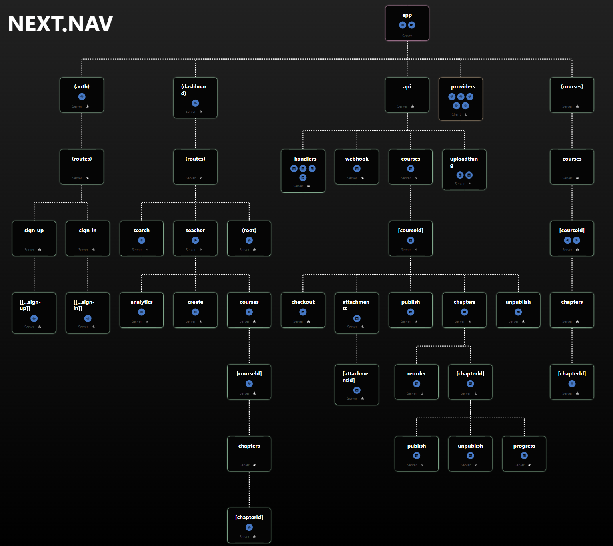

# ROUTES

This document lists all application routes with a short description of each page's purpose. Dynamic routes are noted and explained when they display data for a specific item.

## API routes (server endpoints)

## `/api/courses`
Courses API — endpoints for creating courses.

## `/api/courses/[courseId]`
Single course API (dynamic) — endpoints for managing a specific course identified by `courseId`.

## `/api/courses/[courseId]/checkout`
Checkout API — handles course payment flow and enrollment confirmation.

## `/api/courses/[courseId]/attachments`
Attachments API — manage files and resources attached to a specific course.

## `/api/courses/[courseId]/attachments/[attachmentId]`
Single attachment API (dynamic) — delete specific attachment.

## `/api/courses/[courseId]/publish`
Course publish API — marks a course as published and available for students.

## `/api/courses/[courseId]/unpublish`
Course unpublish API — hides a course from students.

## `/api/courses/[courseId]/chapters`
Chapters API — manage chapters for a specific course.

## `/api/courses/[courseId]/chapters/[chapterId]`
Single chapter API (dynamic) — endpoints for operations on a specific chapter.

## `/api/courses/[courseId]/chapters/[chapterId]/reorder`
Chapter reorder API — update the order of chapters in a course.

---

## `/api/uploadthing`
Upload API — handles secure upload of course media and files.

## `/api/webhook`
Webhook API — Stripe processes events.

---

## `/_providers`
Providers configuration — integration layer for authentication, payment, and media services.
